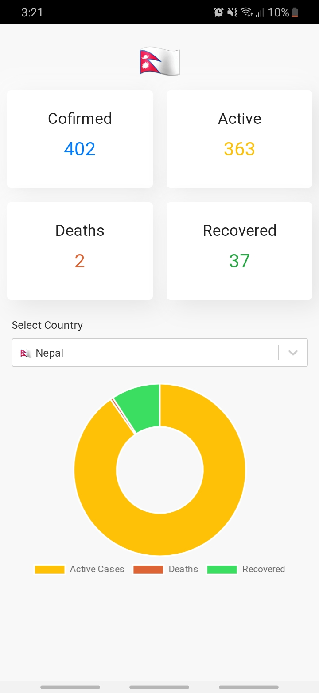

[](https://github.com/rabindratamang/covid-19-stat/actions)


# COVID-19 TRACKER


[mathdroid covid-19-api](https://github.com/mathdroid/covid-19-api) was used for the data source

## Development
The website is built on [ReactJS](https://reactjs.org/). If you are not familiar with React, we suggest checking out their [excellent documentation](https://reactjs.org/docs).

## Installation

1. Clone the branch

   ```
   git clone https://github.com/rabindratamang/covid-19-stat.git
   ```

2. Install dependencies

   ```
   yarn install
   ```

    or alternatively

   ```
   npm install
   ```
3. Start the project
   ```
   npm start
   ```

## Contribution

If you're new to contributing to Open Source on Github, [this guide](https://guides.github.com/activities/contributing-to-open-source/) can help you get started. Please check out the [contribution guide](CONTRIBUTING.md) for more details on how issues and pull requests work.
